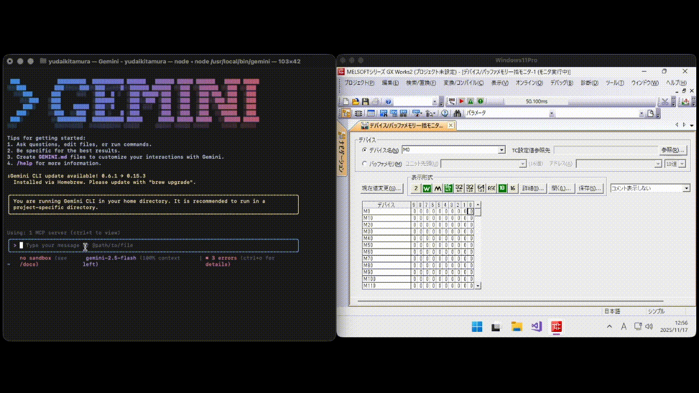

# mcpx-mcp-server

<p>
  <a href="README_JA.md">日本語</a> | <a href="README.md">English</a>
</p>

## Overview
mcpx-mcp-server is an MCP server that allows generative AI to access Mitsubishi PLC devices in real time.

For PLC communication, it uses the NativeAOT build of the MC Protocol library [McpX](https://github.com/YudaiKitamura/McpX).



## Features
- Real-time reading of PLC devices
- Writing to PLC devices
- Operation via natural language instructions from generative AI
- Operation by name
  - By predefining names, you can operate devices without worrying about addresses

## Example Prompts
- Start Conveyor A.
- Stop Conveyor A.
- What is the status of Gate A?
- Open Gate A and then start Conveyor A.
- What is the current production count?
- Set the target production count to 9999.

## Usage
### Prerequisites
The following applications must be installed:
- [Docker](https://www.docker.com/)
- [Docker Compose](https://docs.docker.com/compose/)

### Device Definition
By predefining device definitions (`app/src/address-comment.json`), you can operate devices with named access and apply access rules.

| Field | Description |
|-------|-------------|
| address | Specifies the device address. |
| name | Specifies the device name. |
| comment | Specifies the data type or rules. |

> Note: If you modify the device definitions, you must restart the MCP server.

#### Example Configuration
```json
[
  { "address": "M0", "name": "Conveyor A Start Command", "comment": "true = run, false = stop" },
  { "address": "M1", "name": "Conveyor A Status", "comment": "true = running, false = stopped" },
  { "address": "M2", "name": "Gate A Open Command", "comment": "true = open, false = closed" },
  { "address": "M3", "name": "Gate A Status", "comment": "true = open, false = closed" },
  { "address": "D0", "name": "Production Count", "comment": "short type" }
]
```

### Starting the MCP Server
```sh
docker compose up -d
```

### Stopping the MCP Server
```sh
docker compose down
```

### Configuring the MCP Server
Configure the MCP server according to the generative AI you are using.

#### Example Configuration for Gemini CLI
##### Mac
`/Users/{username}/.gemini/settings.json`  
##### Linux
`/home/{username}/.gemini/settings.json`  
##### Windows
`C:\Users\{username}\.gemini\settings.json`

##### Configuration Content
Add the MCP server information to `settings.json`:
```json
{
  "security": {
    "auth": {
      "selectedType": "oauth-personal"
    }
  },

  "mcpServers": {
    "mcpx": {
      "httpUrl": "http://localhost:3000/mcp"
    }
  }
}
```
